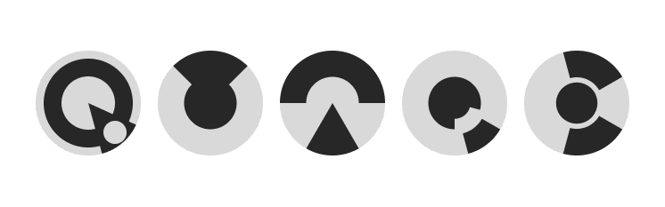

<p align="center">

</p>

# quark
A terminal text editor for Markdown that uses the [Kitty text sizing protocol](https://sw.kovidgoyal.net/kitty/text-sizing-protocol/).

All headings (h1, h2 ... h6) are SGR bold with no color. Headings h1, h2 and h3 use fractional scaling.

> [!CAUTION]
> This app is in early development / unstable. If you need a proper text editor, use vi (or derivatives), Obsidian or another text editor.

## Build

```sh
cmake -S . -B build -DCMAKE_BUILD_TYPE=Release
cmake --build build -j
```

Requires a C++17 compiler and CMake. No external dependencies.

## Usage

```sh
./build/quark            # main menu (logo + Open / New / Quit)
./build/quark <file.md>  # opens existing file or starts a new one
```

Use `test/sample.md` for testing headers, inline styles and emoji/CJK.

## Main menu

Without a file argument quark shows a centered menu. The `Q.png` logo
renders via the [Kitty graphics
protocol](https://sw.kovidgoyal.net/kitty/graphics-protocol/) (embedded in
the binary at build time); other terminals get a plain `quark` title.
Pick **Open file…** (type a path), **New untitled file**, or **Quit** with
Up/Down + Enter, `o`/`n`/`q` shortcuts, or the mouse. Untitled buffers
prompt for a path on `Ctrl-S` (`Save as:`).

## Keys

| Key | Action |
|-----|--------|
| Arrows, Home/End, PgUp/PgDn | Move cursor |
| Type, Enter, Backspace, Delete | Edit |
| Left click | Move cursor (needs a mouse-reporting terminal like kitty) |
| Mouse wheel | Move cursor ±3 lines |
| Shift+click | Terminal text selection |
| Ctrl-C | Quit (asks to save) |


